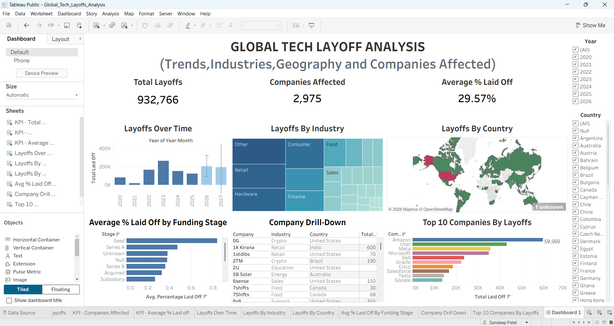

# 🌍 Global Tech Layoffs Analysis

> An interactive Tableau dashboard analyzing global technology layoffs across companies, industries, countries, and funding stages.

[](https://public.tableau.com/app/profile/sandeep.patel3280/viz/Global_Tech_Layoffs_Analysis/Dashboard1)
[](https://github.com/Sandy20082005/global-tech-layoffs-analysis)

---

## 📊 Live Dashboard

### [🚀 View the Interactive Tableau Dashboard →](https://public.tableau.com/app/profile/sandeep.patel3280/viz/Global_Tech_Layoffs_Analysis/Dashboard1)

Explore the complete interactive dashboard on Tableau Public.



---

## 📌 Project Overview

The technology industry has experienced significant workforce reductions across companies, industries, and geographic regions.

This project analyzes a global technology layoffs dataset and transforms the data into an interactive Tableau dashboard designed to explore layoff trends, industry impact, geographic distribution, funding-stage patterns, and company-level statistics.

The dashboard allows users to interact with the data using **Year** and **Country** filters.

---

## 🎯 Objectives

- Analyze technology layoff trends over time
- Identify industries affected by reported layoffs
- Explore the geographic distribution of layoffs
- Compare average layoff percentages across funding stages
- Identify companies with the highest reported layoffs
- Provide an interactive and easy-to-understand data visualization

---

## 📈 Dashboard Highlights

### Key Performance Indicators

| Metric | Value |
|---|---:|
| **Total Layoffs** | 932,766 |
| **Companies Affected** | 2,975 |
| **Average % Laid Off** | 29.57% |

### Visualizations

- 📅 **Layoffs Over Time** — Analyze changes in reported layoffs across years
- 🏭 **Layoffs by Industry** — Compare reported layoffs across industries
- 🌎 **Layoffs by Country** — Explore geographic distribution using an interactive map
- 💰 **Average % Laid Off by Funding Stage** — Compare layoff percentages across funding stages
- 🔎 **Company Drill-Down** — Explore company-level layoff information
- 🏆 **Top 10 Companies by Layoffs** — Identify companies with the highest reported layoff counts

---

## 🎛️ Interactive Features

The dashboard includes:

- **Year Filter** — Analyze specific years
- **Country Filter** — Explore individual countries
- **Interactive Map** — Examine geographic patterns
- **Company Drill-Down** — Explore company-level details
- **Dynamic KPIs** — Metrics update based on selected filters

---

## 🔍 Key Insights

- The dataset contains **932,766 reported layoffs** across **2,975 companies**.
- The overall average percentage of employees laid off is **29.57%**.
- Reported layoffs vary considerably across industries and countries.
- Average layoff percentages differ across funding stages.
- Company-level analysis highlights organizations with the highest reported layoff counts.
- Interactive filtering allows users to move from a global overview to specific years and countries.

> **Note:** These figures represent the records available in the dataset and should not be interpreted as a complete measure of all technology layoffs worldwide.

---

## 🛠️ Tools & Technologies

- **Tableau Public** — Dashboard development and visualization
- **Data Analysis** — Exploratory analysis and KPI development
- **Data Visualization** — Interactive charts, maps, and dashboard design
- **CSV** — Dataset format

---

## 📂 Dataset

The dataset contains information related to technology layoffs, including:

- Company
- Country
- Data Type
- Date
- Date Added
- Industry
- Location
- Source
- Funding Stage
- Funds Raised
- Percentage Laid Off
- Total Laid Off
- Year
- Year-Month

The original dataset is available here:

### [📁 View Dataset →](data/layoffs.csv)

---

## 🔬 Analysis Areas

### 📅 Time Analysis

Examines how reported technology layoffs changed across different years.

### 🏭 Industry Analysis

Compares reported layoffs across different industries.

### 🌎 Geographic Analysis

Uses a world map to explore the geographic distribution of reported layoffs.

### 💰 Funding Stage Analysis

Compares the average percentage of employees laid off across different funding stages.

### 🏢 Company Analysis

Provides company-level drill-down and identifies the Top 10 companies by reported layoffs.

---

## 📦 Project Files

### 📊 Tableau Workbook

The packaged Tableau workbook used to create the dashboard:

### [📥 Download Tableau Workbook →](dashboard/Global_Tech_Layoffs_Analysis.twbx)

---

### 📁 Dataset

Original dataset used for the analysis:

### [📥 View / Download Dataset →](data/layoffs.csv)

---

### 🖼️ Dashboard Preview

Preview image of the completed dashboard:

### [🖼️ View Dashboard Screenshot →](screenshots/dashboard-preview.png)

---

## 📁 Repository Structure

```text
global-tech-layoffs-analysis/
│
├── README.md
│
├── data/
│   └── layoffs.csv
│
├── dashboard/
│   └── Global_Tech_Layoffs_Analysis.twbx

🚀 Future Enhancements

Potential improvements to the project include:

📅 More Recent Data — Incorporate newly reported technology layoffs as additional data becomes available.
🏢 Deeper Company Analysis — Expand company-level analysis with additional metrics and comparisons.
🌎 Regional Analysis — Provide more detailed analysis across regions and individual countries.
📈 Advanced Time Analysis — Introduce monthly and quarterly comparisons to identify more detailed trends.
💰 Funding & Layoffs Analysis — Explore relationships between funding raised and reported layoffs.
📊 Additional KPIs — Introduce additional metrics to provide deeper insights into layoff patterns.
🔎 Advanced Drill-Downs — Add more interactive drill-down capabilities across industries, countries, and companies.
🔗 Additional Data Sources — Combine multiple sources to improve dataset coverage and analysis depth.
🤖 Predictive Analysis — Explore machine learning approaches for analyzing potential future layoff trends.

⚠️ Limitations

📊 Dataset Coverage — The analysis is limited to the records available in the provided dataset and may not represent every technology layoff event worldwide.
📝 Missing Information — Some records may contain missing or incomplete values for certain fields.
📌 Reported Figures — Layoff numbers depend on the information available in the underlying sources.
🏷️ Classification — Company, country, and industry classifications depend on the structure of the source dataset.
🔍 Descriptive Analysis — The project focuses on describing and visualizing reported layoff patterns rather than determining the causes of individual layoffs.
🌍 Global Representation — The results should be interpreted within the coverage and limitations of the available dataset.

👤 Author
Sandeep Patel

MSc Data Science Student | Aspiring Data Analyst
Passionate about data analysis, data visualization, machine learning, and building practical data-driven projects.

🔗 Connect with me
💼 LinkedIn: Sandeep Patel
💻 GitHub: Sandy20082005
📊 Tableau Public: Sandeep Patel
⭐ Explore the Project
📊 Interactive Dashboard

🚀 View Global Tech Layoffs Analysis on Tableau Public →

Explore the complete interactive dashboard with Year and Country filters, KPI metrics, industry analysis, geographic visualization, funding-stage analysis, company drill-down, and Top 10 company analysis.

💻 GitHub Repository

📁 View the Source Repository →

Explore the complete project files, dataset, Tableau workbook, dashboard preview, and project documentation.

⭐ If you found this project interesting, feel free to explore the dashboard and repository.

Built with Tableau Public • Data Analysis • Data Visualization
